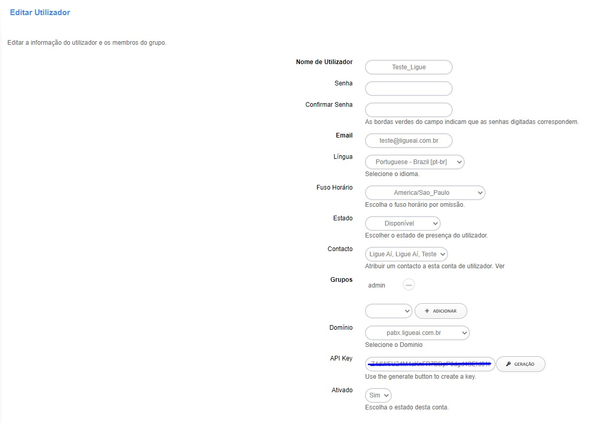

####################
Account Settings
####################

* **Nome do usuário:** O nome do usuário.
* **Senha:** A senha.
* **Confirmar senha:** Deve corresponder à senha.
* **Idioma:** Escolha um idioma para o usuário.
* **Fuso Horário:** Fuso horário específico do usuário.
* **Status:** Usado para central de atendimento e painel do operador.
* **Contato:** O contato do usuário. É usado em uma lista telefônica ou em Aplicativos > Contatos.
* **Grupos:** Grupo em que o usuário está e relacionado ao que o usuário pode ver e fazer nos menus.
* **Domínio:** Domínio específico do usuário.
* **Ativado:** ativa ou desativa a conta.

O fuso horário pode ser definido por usuário, mas também pode ser definido em Menu -> Avançado -> Configurações padrão.
