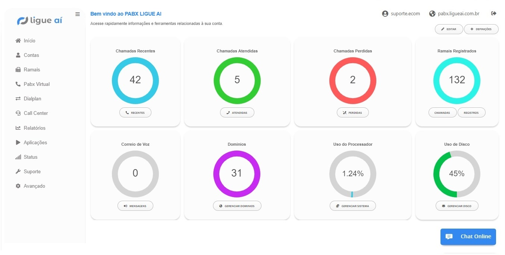

############
Dashboard
############

Acesse rapidamente informações e ferramentas relacionadas à sua conta. Dependendo das permissões do usuário, o usuário pode ver menos opções nesta tela.

* **Correio de Voz:** Correio de voz: Mensagens de voz novas e totais relacionadas à caixa de correio de voz do usuário. Um usuário pode ser atribuído a mais de 1 caixa de correio de voz.
* **Chamadas Perdidas:** Chamadas perdidas para o usuário.
* **Chamadas Atendidas:** Chamadas atendidas para o usuário.
* **Chamadas Recentes:** Número de chamadas nas últimas 24 horas.
* **Estado Sistema:** Uso do disco em porcentagem, versão do FusionPBX, versão do FreeSWITCH, tempo de atividade do FreeSWITCH, tempo de atividade do sistema operacional, uso da CPU, conexões de banco de dados, canais e registros.
* **Roteamento de Chamadas**: veja se o encaminhamento de chamadas, siga-me, não perturbe está definido e um rápido wa para editar essas opções, se necessário.
* **Desvio Grupo de Toque**: Veja o nome, o número do ramal, se o encaminhamento está ativado e para qual número ele é encaminhado.
* **Gerenciar Sistema:** Número de domínios, dispositivos, ramais, gateways, usuários, destinos, filas CC, menus IVR, grupos de toque, correio de voz e se estiverem desabilitados.

`Dashboard Default Settings`_
---------------------------------------

.. _Dashboard Default Settings: /en/latest/advanced/default_settings.html#id5
